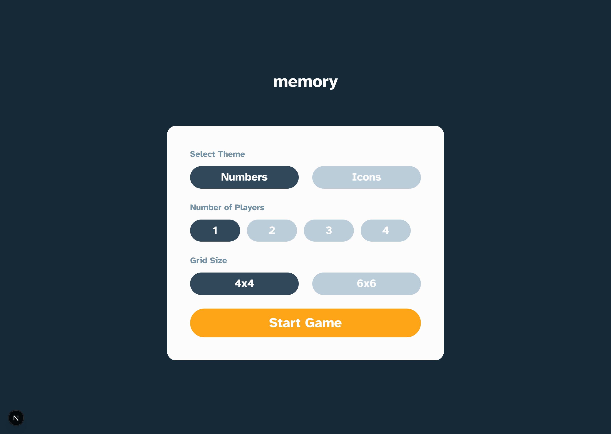
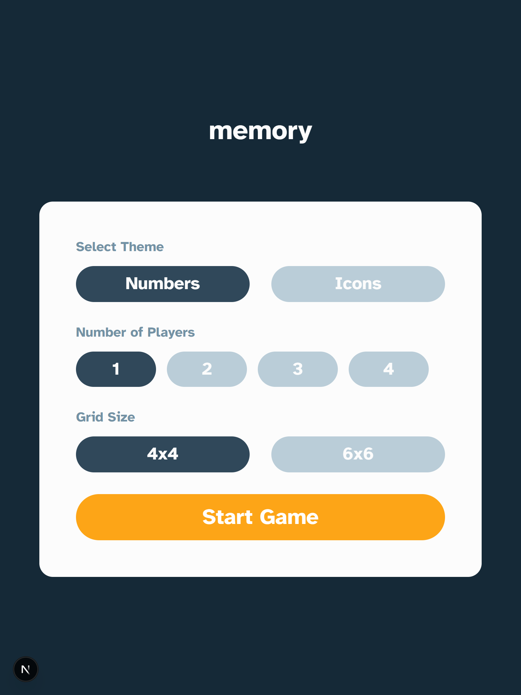
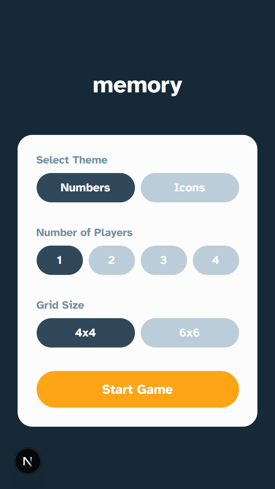

# Frontend Mentor - Memory game solution

This is a solution to the [Memory game challenge on Frontend Mentor](https://www.frontendmentor.io/challenges/memory-game-vse4WFPvM). Frontend Mentor challenges help you improve your coding skills by building realistic projects.

## Table of contents

-   [Overview](#overview)
    -   [The challenge](#the-challenge)
    -   [Screenshot](#screenshot)
    -   [Links](#links)
-   [Getting Started](#getting-started)
    -   [Built with](#built-with)
    -   [Useful resources](#useful-resources)
-   [Author](#author)

## Overview

### The challenge

Users should be able to:

-   View the optimal layout for the game depending on their device's screen size
-   See hover states for all interactive elements on the page
-   Play the Memory game either solo or multiplayer (up to 4 players)
-   Set the theme to use numbers or icons within the tiles
-   Choose to play on either a 6x6 or 4x4 grid

### Screenshot

<table>
 <tr>
    <th>Desktop</th>
    <th>Tablet</th>
    <th>Mobile</th>
  </tr>
  <tr>
    <td></td>
    <td></td>
    <td></td>
  </tr>
</table>

### Links

-   Solution URL: [Link](https://your-solution-url.com)
-   Live Site URL: [Link](https://your-live-site-url.com)

## Getting Started

First, run the development server:

```bash
npm run dev
# or
yarn dev
# or
pnpm dev
# or
bun dev
```

Open [http://localhost:3000](http://localhost:3000) with your browser to see the result.

### Built with

-   Semantic HTML5 markup
-   CSS custom properties
-   Flexbox
-   CSS Grid
-   Mobile-first workflow
-   [React](https://reactjs.org/) - JS library
-   [Next.js](https://nextjs.org/) - React framework
-   [Tailwind CSS](https://tailwindcss.com/) - For styles

### Useful resources

-   [Next.js Documentation](https://nextjs.org/docs) - learn about Next.js features and API.
-   [Learn Next.js](https://nextjs.org/learn) - an interactive Next.js tutorial.

## Author

-   Website - [Habeeb Kareem](https://habeeb-dev.netlify.app)
-   Frontend Mentor - [@olaide-hok](https://www.frontendmentor.io/profile/olaide-hok)
